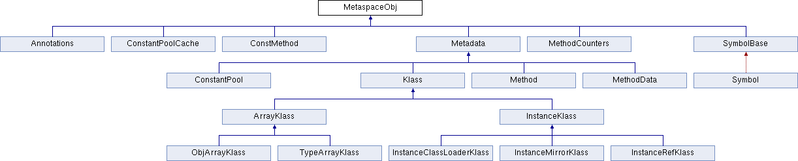
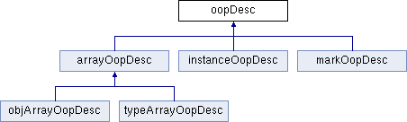
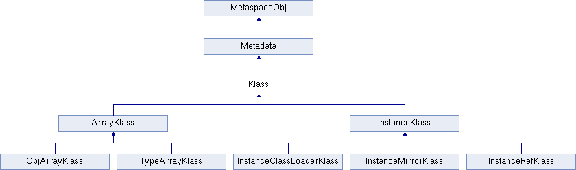
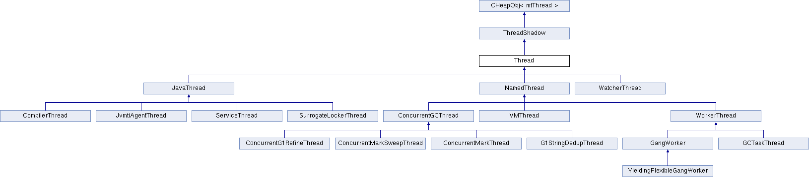

# OpenJDK HotSpot RTFSC

## 编译

code: `https://github.com/AdoptOpenJDK/openjdk-jdk8u`

不同的版本在Mac下有不同的编译错误信息, 可以参照时事修正文档.

## 项目结构

- [jdk8u252-b08](https://github.com/AdoptOpenJDK/openjdk-jdk8u)

```
├── cpu
├── os
├── os_cpu
└── share
    ├── tools
    └── vm
        ├── adlc                        // Architecture Description Language Compiler
        ├── asm                         // platform-independent assembler
        ├── c1                          // C1 Compiler
        ├── ci                          // 动态编译器
        ├── classfile                   // 类文件解析和类的链接等
        ├── code                        // 机器码生成
        ├── compiler                    // 调用动态编译器的接口
        ├── gc_implementation           // GC实现
        │   ├── concurrentMarkSweep
        │   ├── g1
        │   ├── parNew
        │   ├── parallelScavenge
        │   └── shared
        ├── gc_interface                // GC接口
        ├── interpreter                 // 解释器
        ├── libadt                      // 抽象数据结构
        ├── memory                      // 内存管理
        ├── oops                        // VM内部对象表示
        ├── opto                        // C2 Compiler
        ├── precompiled
        ├── prims                       // 对外接口
        ├── runtime                     // 运行时
        ├── services                    // Serviceability
        ├── shark                       // LLVM based Compiler
        ├── trace
        └── utilities                   // 内部工具
```

## Convensions in Codes

```
allocation.hpp

// All classes in the virtual machine must be subclassed
// by one of the following allocation classes:
//
// For objects allocated in the resource area (see resourceArea.hpp).
// - ResourceObj
//
// For objects allocated in the C-heap (managed by: free & malloc).
// - CHeapObj
//
// For objects allocated on the stack.
// - StackObj
//
// For embedded objects.
// - ValueObj
//
// For classes used as name spaces.
// - AllStatic
//
// For classes in Metaspace (class data)
// - MetaspaceObj
//
```

- MetaspaceObj



## VM Internal Representation of Java Classes and Objects

- oop: Ordinary Object Pointer



- Klass




|抽象|说明|补充|
|:----|:----|:----|
| annotations               | 注解 | |
| compiledICHolder          |  | |
| constMethod               | Java方法中不变的部分. | 头文件中有内存布局的说明. |
| constantPool              | `ConstantPool`: 类文件中描述的类常量的数组. | |
| cpCache                   | `ConstantPoolCache`: 伴随常量池的运行时数据结构, 持有访问字段和调用字节码的解释器运行时信息. | |
| generateOopMap            | 计算方法中指针映射??? | |
| symbol                    | `Symbol`: 类文件中符号表中的符号, 被引用计数. | |
| klass                     | `Klass`: 提供了 (1) 语言层次的类对象(方法字典等), (2) 提供了对象上的VM分发行为. | 头文件中有布局的说明. |
| instanceKlass             | `InstanceKlass`: Java类的VM层级表示, 包含了执行运行时所需的信息.  | 头文件中有布局的说明.|
| instanceOop               | Java类的一个实例.  | |
| instanceClassLoaderKlass  | `InstanceClassLoaderKlass` | |
| instanceMirrorKlass       | `InstanceMirrorKlass`: 用于Java的`java.lang.Class`的特殊`InstanceKlass`. | |
| instanceRefKlass          | Java `java.lang.ref.Reference`的子类的特殊 | |
| arrayKlass                | `ArrayKlass`: 数组类型的抽象基类 | |
| arrayOop                  | `arrayOopDesc`: 数组OOP | 头文件中有布局的说明. |
| objArrayKlass             | `ObjArrayKlass`: objArray的klass. |  |
| objArrayOop               | `objArrayOopDesc`: 元素为OOP的数组objArray. | |
| typeArrayKlass            | `TypeArrayKlass`: typeArray的klass, 包含元素的类型和大小. | |
| typeArrayOop              | `typeArrayOopDesc`: 元素为基本类型(非OOP)的数组typeArray. | |
| klassVtable               | `klassVtable`: `InstanceKlass`和`ArrayKlass`中变长vtable的抽象. <br> `klassItable`: Java接口相关的vtable. | |
| oop                       | `oopDesc`: OOP抽象基类 | |
| oopsHierarchy             | (1) 表示性的对象层次: `oop`, `instanceOop`, `arrayOop`, `objArrayOop`, `typeArrayOop`. <br> (2) metadata层次: `MetaspaceObj`, `Metadata`, `CHeapObj` (3) klass层次: `InstanceKlass`, `ArrayKlass` | |
| markOop                   | `markOopDesc`: 对象头的抽象. | 头文件中有对象头的位格式说明. |
| metadata                  | `Metadata`: 内部类相关的元数据. | |
| method                    | `Method`: Java方法的抽象. | 头文件中有内存布局的说明. |
| methodCounters            |  | |
| methodData                | `MethodData`: 收集解释和执行时的计数器和其它度量信息, 用于后续的启发式编译.  | |


### markOop: the header of an object

```
markOop.hpp

// The markOop describes the header of an object.
//
// Note that the mark is not a real oop but just a word.
// It is placed in the oop hierarchy for historical reasons.
//
// Bit-format of an object header (most significant first, big endian layout below):
//
//  32 bits:
//  --------
//             hash:25 ------------>| age:4    biased_lock:1 lock:2 (normal object)
//             JavaThread*:23 epoch:2 age:4    biased_lock:1 lock:2 (biased object)
//             size:32 ------------------------------------------>| (CMS free block)
//             PromotedObject*:29 ---------->| promo_bits:3 ----->| (CMS promoted object)
//
//  64 bits:
//  --------
//  unused:25 hash:31 -->| unused:1   age:4    biased_lock:1 lock:2 (normal object)
//  JavaThread*:54 epoch:2 unused:1   age:4    biased_lock:1 lock:2 (biased object)
//  PromotedObject*:61 --------------------->| promo_bits:3 ----->| (CMS promoted object)
//  size:64 ----------------------------------------------------->| (CMS free block)
//
//  unused:25 hash:31 -->| cms_free:1 age:4    biased_lock:1 lock:2 (COOPs && normal object)
//  JavaThread*:54 epoch:2 cms_free:1 age:4    biased_lock:1 lock:2 (COOPs && biased object)
//  narrowOop:32 unused:24 cms_free:1 unused:4 promo_bits:3 ----->| (COOPs && CMS promoted object)
//  unused:21 size:35 -->| cms_free:1 unused:7 ------------------>| (COOPs && CMS free block)
//
//  - hash contains the identity hash value: largest value is
//    31 bits, see os::random().  Also, 64-bit vm's require
//    a hash value no bigger than 32 bits because they will not
//    properly generate a mask larger than that: see library_call.cpp
//    and c1_CodePatterns_sparc.cpp.
//
//  - the biased lock pattern is used to bias a lock toward a given
//    thread. When this pattern is set in the low three bits, the lock
//    is either biased toward a given thread or "anonymously" biased,
//    indicating that it is possible for it to be biased. When the
//    lock is biased toward a given thread, locking and unlocking can
//    be performed by that thread without using atomic operations.
//    When a lock's bias is revoked, it reverts back to the normal
//    locking scheme described below.
//
//    Note that we are overloading the meaning of the "unlocked" state
//    of the header. Because we steal a bit from the age we can
//    guarantee that the bias pattern will never be seen for a truly
//    unlocked object.
//
//    Note also that the biased state contains the age bits normally
//    contained in the object header. Large increases in scavenge
//    times were seen when these bits were absent and an arbitrary age
//    assigned to all biased objects, because they tended to consume a
//    significant fraction of the eden semispaces and were not
//    promoted promptly, causing an increase in the amount of copying
//    performed. The runtime system aligns all JavaThread* pointers to
//    a very large value (currently 128 bytes (32bVM) or 256 bytes (64bVM))
//    to make room for the age bits & the epoch bits (used in support of
//    biased locking), and for the CMS "freeness" bit in the 64bVM (+COOPs).
//
//    [JavaThread* | epoch | age | 1 | 01]       lock is biased toward given thread
//    [0           | epoch | age | 1 | 01]       lock is anonymously biased
//
//  - the two lock bits are used to describe three states: locked/unlocked and monitor.
//
//    [ptr             | 00]  locked             ptr points to real header on stack
//    [header      | 0 | 01]  unlocked           regular object header
//    [ptr             | 10]  monitor            inflated lock (header is wapped out)
//    [ptr             | 11]  marked             used by markSweep to mark an object
//                                               not valid at any other time
//
//    We assume that stack/thread pointers have the lowest two bits cleared.
```

## Runtime

|抽象|说明|补充|
|:----|:----|:----|
| advancedThresholdPolicy   | 执行层次阈值策略 | 头文件中有执行层次的说明. |
| arguments, arguments_ext  | 命令行参数和选项的解析. | |
| atomic                    | 原子操作定义. | 实现文件中依赖操作系统中特定的原子操作. 例如: `os_cpu/linux_x86/vm/atomic_linux_x86.inline.hpp` |
| basicLock                 | `BasicLock`: 基本的锁(`markOop _displaced_header;`)<br>`BasicObjectLock`: 将Java对象与`BasicLock`关联(`BasicLock _lock; oop _obj;`)| |
| biasedLocking             | `BiasedLocking`: 偏向封锁. | |
| compilationPolicy         | `CompilationPolicy`: 选择应该被编译的方法. | |
| deoptimization            | `Deoptimization`: ??? | |
| dtraceJSDT                | `DTraceJSDT`: ??? | |
| extendedPC                | `ExtendedPC`: 独立于平台的信号处理器中的PC. | |
| fieldDescriptor           | `fieldDescriptor`: 单个字段(示例或类变量)的属性. | |
| fieldType                 | `FieldType`: 用于从签名字符串中确定字段的类型. | |
| fprofiler                 | `FlatProfiler`: 一个简单的Java profiler. | |
| frame                     | `frame`: 物理栈帧的抽象. | |
| globals, globals_ext, globals_extension | `Flag`: 全局标志. | |
| handles                   | `Handle`: 为在GC时保留oops, 在VM内部通过句柄分配和传递oops.| |
| icache                    | `AbstractICache`: 更新指令缓存的接口. | |
| init                      | 初始化动作定义: 会调用主Java线程和VM线程的构造器. | |
| interfaceSupport          | VN所有进去点的包装器. | |
| java                      | VM操作和JDK版本信息. | |
| javaCalls                 | `JavaCallWrapper`: 在每个JavaCall之前构造出, 在调用之后析构. | |
| javaFrameAnchor           | `JavaFrameAnchor`: 封装`JavaThread`帧状态中独立于机器/操作系统的部分. | |
| jfieldIDWorkaround        | `jfieldIDWorkaround`: 用于在JVMTI中区分`jfieldID`是属于实例的还是静态的. | |
| jniHandles                | `JNIHandles`: 创建和解析局部/全局JNI句柄的接口. | |
| jniPeriodicChecker        | `JniPeriodicChecker`: JNI周期性检查器, 由`Xcheck:jni`激活. | |
| memprofiler               | `MemProfiler`: 周期性的打印VM中内存使用痕迹. | |
| monitorChunk              | `MonitorChunk`: 去优化时持有监视器的数据结构. | |
| mutex                     | `class Mutex : public Monitor`: 平行于Java监视器的设计,   | |
| mutexLocker               | | |
| objectMonitor             | `ObjectMonitor`: 用于实现Java监视器, 它已经由于竞争从线程栈的轻量级结构转换为重量级锁. | |
| orderAccess               | `OrderAccess`: 内存访问顺序模型. | |
| os, os_ext                | `os`: 定义了访问操作系统的接口. | |
| osThread                  | `OSThread`: 持有特定于操作系统的线程信息. | |
| park                      | `Parker`: JSR166-JUC park-unpark.<br>`ParkEvent`: Java-level "monitor" synchronization. | |
| perfData                  | `PerfData`: 性能数据抽象. | |
| perfMemory                | `PerfMemory`: `PerfData`区域管理. | |
| prefetch                  | `Prefetch`: 将数据预取到缓存. | |
| reflection                | `Reflection`: 包含实现反射API所需的工具方法. | |
| reflectionUtils           | `KlassStream`, `FieldStream`, `MethodStream`: 用于的反射的流抽象. | |
| registerMap               | `RegisterMap`: 用于栈遍历的伴生结构. | |
| relocator                 | `Relocator`: code relocations | |
| rframe                    | rframes: recompiler frames | |
| rtmLocking                | RTM: Restricted Transactional Memory | |
| safepoint                 | `SafepointSynchronize`: 安全点同步. | |
| serviceThread             | `ServiceThread`: 用于低内存检测支持和JVMTI已编译代码加载事件的`JavaThread`. | |
| sharedRuntime, sharedRuntimeMath | `SharedRuntime`: 提供了运行时中通用的功能. | |
| signature                 | Java签名的抽象. | |
| simpleThresholdPolicy     | `SimpleThresholdPolicy`: 基于阈值的`CompilationPolicy`. | |
| stackValue, stackValueCollection | `StackValue`: Java栈槽值的抽象<br> `StackValueCollection`: `StackValue`的集合. | |
| statSampler               | `StatSampler`: 统计信息的周期性采样器. | |
| stubCodeGenerator         | 代码的生成/调试和打印的基础框架. | |
| stubRoutines              | `StubRoutines`: 提供了编排用于已编译代码和运行时系统的routine的入口项. | |
| sweeper                   | `vm/nmethods`(native methods)的增量清理器. | |
| synchronizer              |`ObjectSynchronizer`: ???<br>ObjectLocker: ??? | |
| task                      | `PeriodicTask`: 周期性任务. | |
| thread, thread_ext        | `Thread`: 线程抽象. | |
| threadCritical            | `ThreadCritical`: 用于保护短时非阻塞的关键区域. | |
| threadLocalStorage        | 线程本地存储的接口. | |
| timer                     | 定时器. | |
| unhandledOops             | `UnhandledOops`: 未被处理的oop. | |
| vframe                    | `vframe`: 表示源码层活动的虚拟栈帧. | |
| vframeArray               | `vframeArray`: 用于在去优化时临时保存栈外Java方法活动的数组. | |
| vframe_hp                 | `compiledVFrame`: 已编译的`javaVFrame`. | |
| virtualspace              | `ReservedSpace`: 预留连续地址范围的数据结构. | |
| vmStructs                 | `VMStructs`: 封装了serviceability agent运行所需的调试信息. | |
| vmThread                  | `VMThread`: spawn其它线程. | |
| vm_operations             | 由`JavaThread`发起的, 但必须在`VMThread`中执行的操作. | |
| vm_version                | 提供关于VM的信息. | |


### Thread

- runtime/OSThread

- runtime/Thread


